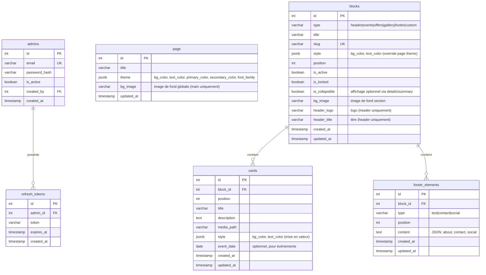

# Projet : Site Institutionnel Batala LR (PWA + Node.js SSR)

## 🎯 Objectif
Créer un site builder générique de type WMS (Website Management System) ou SPS (Site Pesonalization system). 
Le site par défaut présente un header, les activités ou événements à venir, offres de prestation et contacts.  
Les administrateurs peuvent se connecter pour gérer dynamiquement le contenu (blocs, images, textes, ordre, etc.).
Le thème de la page est personnalisable via l'admin (couleurs, polices, logos).
Chaque bloc peut être activé/désactivé, et son contenu peut être modifié.
Chaque bloc peut avoir un titre et un style personnalisé.
Chaque bloc peut avoir une image de fond ou une couleur de fond. Si rien n'est spécifié, utiliser les valeurs par défaut de la page.
Chaque bloc peut contenir plusieurs cartes (ex: offres, actualités) avec images et descriptions. L'odre des blocs et des cartes est modifiable via drag & drop.
Tant que nous sommes en phase de développement, les scripts de création des tables et d'initialisation des données sont réécris et rechargés à chaque redémarrage. Pas de migration ni de sauvegarde des données nécessaires pour l'instant, pas de volume pour la base de données.
Pour les administrateurs, tout se fait en WYSIWYG sur la page du site (pas de dashboard séparé) : chaque bloc a un bouton "éditer" qui ouvre un formulaire inline pour modifier le contenu, ajouter/supprimer des cartes, changer l'ordre, etc.
Les blocs autres que header et footer sont optionnels et peuvent être ajoutés/supprimés dynamiquement. Ces blocs peuvent être affichés par défaut ou se déplier via un bouton "voir plus". On utilisera les balises HTML5 sémantiques appropriées pour chaque section (header, main, section, footer). Pour l'affichage optionnel, on utilisera le détail/summary HTML5.
Le site doit être responsive (mobile first) et accessible (WCAG 2.1 AA). Si la navigation est activée dans le header, les liens doivent pointer vers les sections correspondantes de la page (ancre HTML). Pour l'affichage sur mobile, le menu de navigation doit être un menu hamburger. Celui-ci peut être implémenté avec du JavaScript léger ou en CSS pur (checkbox hack). Pas de librarries externes pour cela.
Les icônes seront toutes des svg placées individuellement dans le dossier public/icons/. On utilisera des icônes personnalisées pour le bouton admin (connexion), le bouton scroll-to-top, les réseaux sociaux dans le footer, et les icônes de navigation si nécessaire. Tout est "en dur".
Les icônes du site seront toutes des SVG monochromes dont la couleur pourra être modifiée via CSS (fill="currentColor"). Leur aspect (taille, couleur) sera contrôlé via des classes CSS. Par exemple, pour les icônes de réseaux sociaux dans le footer, elles seront affichées en gris clair par défaut et deviendront colorées au survol (hover).
Pour les générer, on s'inspirera des icônes Font Awesome libres de droit disponibles dans react-icones, par exemple FaEdit, FaPlus, FaTrash, FaArrowUp, FaArrowDown, FaFacebook, FaTwitter, FaInstagram, FaLinkedin, FaYoutube, etc.
Les icônes de réseaux sociaux dans le footer sont configurables via l'admin : l'admin peut ajouter/supprimer des icônes (choisir parmi un set prédéfini : facebook, twitter, instagram, linkedin, youtube) et spécifier l'URL correspondante.
Les blocs non renseignés sont affichés avec un contenu par défaut dont les images et les textes sont stockés localement dans le dossier public/assets/ et référencés dans le code:
- header-bg-default.jpg
- logo-default.svg
- pour les autres blocs, par défaut, utiliser une couleur de fond neutre.
- pour les cartes, utiliser des images génériques (placeholder-1.svg, placeholder-2.svg, etc.) et du texte factice (Lorem ipsum).

Blocs possibles :
- Header : logo, titre, image de fond, bouton de connexion admin, navigation en option vers les sections (ou blocs)
- Evénements à venir : liste des événements avec date, description, image
- Offres de prestation : liste des offres avec titre, description, image
- Galerie d'images : carrousel ou grille d'images
- Footer : texte de contact, liens réseaux sociaux, mentions légales, liens externes, crédits à caixadev.dev

Création d'un dossier uploads pour les images uploadées par l'admin. Ces images sont référencées dans la base de données avec leur chemin relatif (ex: /uploads/monimage.jpg). Chaque nouvel upload écrase le fichier existant précédemment pour ce rôle. Toutefois, les images par défaut ne sont pas écrasées.

**Stack actuelle** : Node.js (ESM) + Express + Pug + PostgreSQL  
**Stack cible** : Node.js (ESM) + Express + **EJS** + PostgreSQL  
Tests : Jest (TDD) + Playwright (E2E)  
Déploiement : Docker + NAS (pull automatique)  
Analyse : SonarCloud + Lighthouse  
Gestion : GitHub Copilot Pro + GitHub Projects (Epics, branches, PR, revues IA)

---

## 🗄️ Architecture de la Base de Données

### Diagramme ERD (Mermaid)

### Règles de Conception

**Page (`page`)** :
- Table singleton (1 seule ligne) pour le thème global
- `theme` (JSONB) : `{ bg_color, text_color, primary_color, secondary_color, font_family }`
- `bg_image` : image de fond globale (appliquée sur `<main>`, pas sur header/footer)
- Modifiable via color picker admin + upload d'image

**Blocs (`blocks`)** :
- **Header** : `header_logo`, `header_title`, `bg_image` (champs directs)
- **Sections (events, offers, gallery, custom)** : `title`, `bg_image`, `style` (JSONB) + relation vers `cards`
- **Footer** : utilise `footer_elements` (structure JSON flexible pour about/contact/social)
- `style` (JSONB) : `{ bg_color, text_color }` → override du thème page si renseigné
- `is_active` : activation/désactivation du bloc
- `is_collapsible` : si true, utilise `
/
` pour affichage optionnel

**Cartes (`cards`)** :
- Template réutilisable : actualités, événements, offres, galerie, etc.
- `event_date` (DATE NULL) : optionnel, pour événements uniquement
- `style` (JSONB) : `{ bg_color, text_color }` → mise en valeur d'une carte spécifique
- `media_path` : chemin vers l'image (uploads ou assets par défaut)

**Éléments de footer (`footer_elements`)** :
- Réservé au **footer uniquement**
- Types : `text` (about), `contact` (email/phone), `social` (liens réseaux)
- `content` (TEXT/JSON) : structure flexible selon le type

---

## 🔄 Évolutions Prévues

### Migration Pug → EJS
**Raison** : EJS est plus simple à maintenir, syntaxe proche du HTML standard.

**Plan** :
1. Installer EJS : `npm install ejs`
2. Convertir toutes les vues :
   - `layout.pug` → `layout.ejs`
   - `index.pug` → `index.ejs`
   - `components/*.pug` → `components/*.ejs`
3. Adapter `src/server.js` : `app.set('view engine', 'ejs')`
4. Vérifier les tests
5. Supprimer les fichiers `.pug`

### Icônes SVG (Batch généré ✅)

**Liste complète des icônes monochromes** (fill="currentColor") disponibles :

**Admin & Actions (13) :**
- `settings.svg` (roue crantée), `user.svg` (avatar connexion)
- `edit.svg`, `plus.svg`, `trash.svg`, `save.svg`, `cancel.svg`
- `arrow-up.svg`, `arrow-down.svg`, `menu.svg` (burger), `close.svg` (X)
- `palette.svg` (color picker), `image.svg` (upload)

**Réseaux sociaux grand public (14) :**
- `facebook.svg`, `instagram.svg`, `linkedin.svg`, `youtube.svg`, `tiktok.svg`, `twitter.svg`
- `whatsapp.svg`, `telegram.svg`, `pinterest.svg`, `snapchat.svg`, `threads.svg`
- `bluesky.svg`, `mastodon.svg`, `reddit.svg`

**Outils professionnels (7) :**
- `discord.svg`, `slack.svg`, `teams.svg`, `zoom.svg`, `skype.svg`
- `github.svg`, `gitlab.svg`

**Total : 34 icônes** couvrant 80%+ des plateformes les plus utilisées

Emplacement : `public/icons/` (viewBox="0 0 24 24" standard)

**Génération** : Inspirées de Font Awesome / Simple Icons (libres de droits)

### Menu de Navigation

**Implémentation** : CSS pur avec checkbox hack
- Desktop : liens horizontaux dans le header
- Mobile : menu hamburger (icône `menu.svg` → overlay avec liens)
- Ancres HTML pointant vers `#slug` des blocs actifs

### Autres Améliorations Envisagées
- ✅ Table `page` pour thème global
- ✅ JSONB `style` pour blocs et cartes
- ✅ Champ `is_collapsible` pour blocs optionnels
- ✅ Champ `event_date` pour cartes événements
- [ ] Drag & drop ordre blocs/cartes (JS vanilla ou SortableJS)
- [ ] Color picker admin (input type="color" natif)
- [ ] Upload images avec prévisualisation
- [ ] Validation accessibilité (axe-core ou pa11y)

---

## 🧩 Épics

## 🧩 Épics et User Stories

### Epic 1 : Infrastructure & Configuration
**Backlog**
- US1.1 : Initialiser le projet Node.js + Express + EJS + PostgreSQL
- US1.2 : Ajouter ESM, Jest, Playwright
- US1.3 : Configurer ESLint et Prettier
- US1.4 : Ajouter gestion .env (dotenv)
- US1.5 : Mettre en place Dockerfile + docker-compose.yml
- US1.6 : Configurer GitHub Actions (lint, test, audit, build, push Docker)
- US1.7 : Configurer SonarCloud & Lighthouse
- US1.8 : Configurer GitHub Copilot Pro + GitHub Projects

### Epic 2 : Authentification et Sécurité
**Backlog**
- US2.1 : Authentification JWT + Refresh Token (HttpOnly)
- US2.2 : Mot de passe hashé avec Argon2id
- US2.3 : Gestion utilisateurs admin (création, invitation par email)
- US2.4 : Page de création de mot de passe via lien email
- US2.5 : Middleware de protection des routes /dashboard

### Epic 3 : Gestion de Contenu (CMS simplifié)
**Backlog**
- US3.1 : CRUD des blocs dynamiques (header, sections, footer)
- US3.2 : Modification de l’ordre des blocs (drag & drop)
- US3.3 : Upload d’images/documents
- US3.4 : Validation et nettoyage des entrées (regex + sanitization)
- US3.5 : Accessibilité ARIA + navigation clavier

### Epic 4 : Interface Utilisateur (PWA)
**Backlog**
- US4.1 : Page publique SSR avec Hero, sections dynamiques, footer
- US4.2 : Bouton admin SVG pour connexion
- US4.4 : Animation fluide et transitions légères (CSS)
- US4.5 : Bouton scroll-to-top SVG
- US4.6 : Manifest + Service Worker (offline + installable)

### Epic 5 : Tests & Qualité
**Backlog**
- US5.1 : Tests unitaires TDD (Jest)
- US5.2 : Tests E2E pour flux critiques (Playwright)
